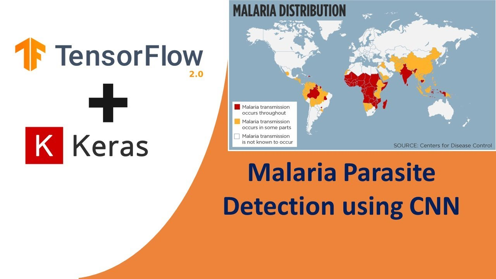
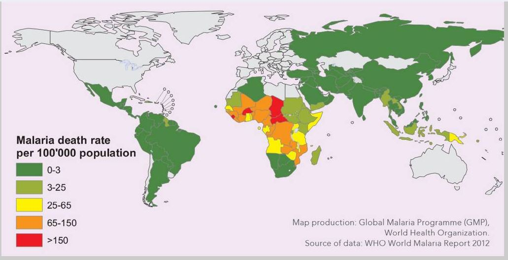
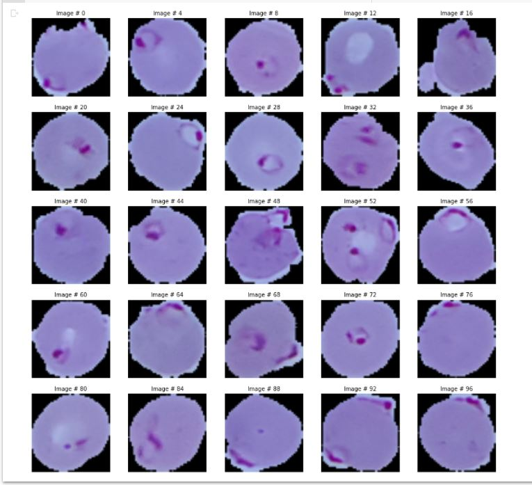
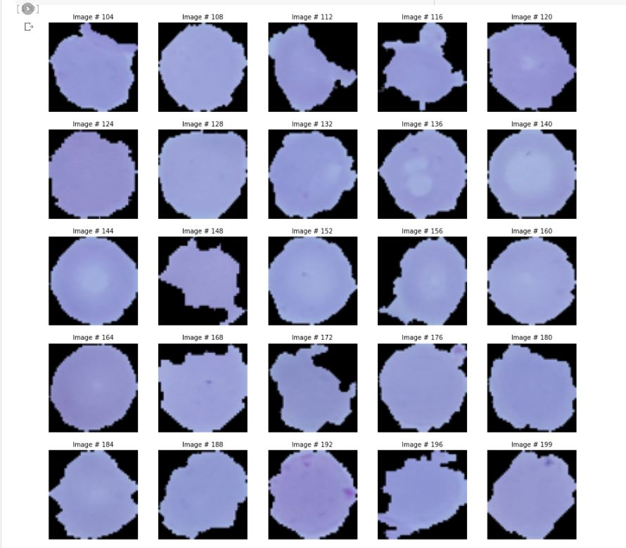
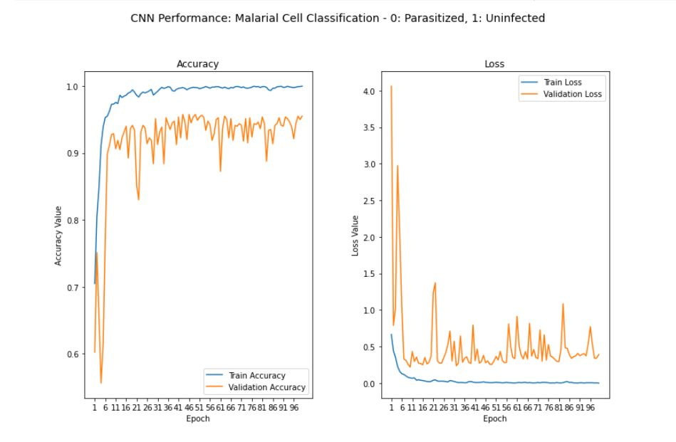

# Malaria Cells Classification using Convolutional Neural Networks (CNN)

## 1. Objective

The objective of this project is to develop, train and evaluate the performance of a Convolutional Neural Networks (CNN) model to classify malaria cells into uninfected or infected classes.  

## 2. Motivation

Malaria remains a major burden on global health, especially in tropical countries, as illustrated in the figure below. Hundreds of millions of blood films are examined every year for malaria, which involves manual counting of parasites and infected red blood cells by a trained microscopist. Accurate parasite counts are essential not only for malaria diagnosis. They are also important for testing for drug-resistance, measuring drug-effectiveness, and classifying disease severity. However, microscopic diagnostics is not standardized and depends heavily on the experience and skill of the microscopist. It is common for microscopists in low-resource settings to work in isolation, with no rigorous system in place that can ensure the maintenance of their skills and thus diagnostic quality. This leads to incorrect diagnostic decisions in the field. For false-negative cases, this leads to unnecessary use of antibiotics, a second consultation, lost days of work, and in some cases progression into severe malaria. For false-positive cases, a misdiagnosis entails unnecessary use of anti-malaria drugs and suffering from their potential side effects, such as nausea, abdominal pain, diarrhea, and sometimes severe complications [1]. 

Recently, the application of machine and deep learning, for the classification of malarial cells has been explored and demonstrated to yield high accuracy [1-8]. In this work, we shall demonstrate such an application. In particular, we design, train and evaluate the performance of the convolutional network (CNN) to classify malarial cells.

## 3. Data

We make use of the open source Malaria Datasets made available by the National Institute of Medicine.  The data set consists of:

* 13,779 image patches of parasitized/infected cell
* 13,779 image patches of uninfected/healthy cells.

The  classification of the malaria cells using this data set involves the following 3 step: 

* Split this dataset into:
* Training data subset (80%)
* Testing data subsets (20%)
* Train the design CNN model on the training data subset
* Evaluate the performance of the trained model, in terms of classification accuracy, on the test data subset.

## 4. Development

In this section, we shall develop, train, deploy and evaluate the performance of a CNN model to classify malaria cells into parasitized (0) or uninfected (1).

* Author: Mohsen Ghazel (mghazel)
* Date: April 1st, 2021
* Project: Classification of Malarial Cells using Convolutional Neural Networks (CNN):
The objective of this project, we develop a Convolutional Network Model (CNN) to classify Malarial cells into:

  * Parasitized/infected cell (0)
  * Uninfected/healthy cell (1)
  
We shall demonstrate the end-to-end process, step by step.

### 4.1: Step 1: Python imports and global variables

#### 4.1.1. Imports:

<pre style="color:#000000;background:#e6ffff;font-size:10px;line-height:1.5;">print(__doc__)

Automatically created module for IPython interactive environment
</pre>

<pre style="color:#000000;background:#e6ffff;font-size:10px;line-height:1.5;"># numpy
import numpy as np
# matplot lib
import matplotlib.pyplot as plt
# opencv
import cv2
# PIL library
from PIL import Image
# keras
import keras

# sklearn imports
# - nededed for splitting the dataset into training and testing subsets
from sklearn.model_selection import train_test_split
# - nededed for 1-hot coding of the image labels
from keras.utils import to_categorical

# set the keras backend to tensorflow
# os.environ['KERAS_BACKEND'] = 'tensorflow'
# I/O
import os
# sys
import sys

# datetime
import datetime

# check for successful package imports and versions
# python
print("Python version : {0} ".format(sys.version))
# OpenCV
print("OpenCV version : {0} ".format(cv2.__version__))
# numpy
print("Numpy version  : {0}".format(np.__version__))
</pre>

<pre style="color:#000000;background:#ffffff;font-size:10px;">Python version : 3.7.10 (default, Feb 20 2021, 21:17:23) 
[GCC 7.5.0] 
OpenCV version : 4.1.2 
Numpy version  : 1.19.5
</pre>

<pre style="color:#000000;background:#e6ffff;font-size:10px;line-height:1.5;"># Mount my Google drive to access the dataset
from google.colab import drive
drive.mount('/content/drive')
</pre>

<pre style="color:#000000;background:#ffffff;font-size:10px;">Drive already mounted at /content/drive; 
to attempt to forcibly remount, 
call drive.mount("/content/drive", force_remount=True).
</pre>

#### 4.1.2. Global variables

<pre style="color:#000000;background:#e6ffff;font-size:10px;line-height:1.5;">#-------------------------------------------------------------------------------
# We set the Numpy pseudo-random generator at a fixed value:
#-------------------------------------------------------------------------------
# - This ensures repeatable results everytime you run the code. 
np.random.seed(101)

#-------------------------------------------------------------------------------
# Set the random state to 101
#-------------------------------------------------------------------------------
# - This ensures repeatable results everytime you run the code. 
RANDOM_STATE = 101

#-------------------------------------------------------------------------------
# Set the data directory where malaria data set is stored
#-------------------------------------------------------------------------------
image_directory = '/content/drive/MyDrive/.../cell_images/'

#-------------------------------------------------------------------------------
# set the input images size
#-------------------------------------------------------------------------------
INPUT_IMAGE_SIZE = 64

#-------------------------------------------------------------------------------
# We use the Malaria dataset from the National Librray of Medicine:
#-------------------------------------------------------------------------------
# - Source: https://lhncbc.nlm.nih.gov/LHC-publications/pubs/MalariaDatasets.html
# - It has 13,779 images of parasitized images
# - It has 13,779 images of uninfected images
# - Due to our limited computational resources, we shall only use a subset of 
#   this dataset
#-------------------------------------------------------------------------------
# the number of used images from the parasitized and uninfected available data 
# sets
#-------------------------------------------------------------------------------
NUM_USED_DATASET_IMAGES = 5000

#-------------------------------------------------------------------------------
# The available labelled dataset is spit into subsets:
#-------------------------------------------------------------------------------
# - Testing data subset
# - Training data subset
#-------------------------------------------------------------------------------
# This parameter indicates the proportion of randomly selected test data 
# subset from the the full data set
#-------------------------------------------------------------------------------
TEST_DATA_SUBSET_PROPORTION = 0.20 # 20% of data is used for testing
</pre>

### 4.2. Step 2: Read and visualize the input data set

We use the Malaria dataset from the National Library of Medicine:
Source: https://lhncbc.nlm.nih.gov/LHC-publications/pubs/MalariaDatasets.html
It has 13,779 images of parasitized images
It has 13,779 images of uninfected images

Due to our limited computational resources, we shall only use a subset of this dataset:
NUM_USED_DATASET_IMAGES: number of images of parasitized images
NUM_USED_DATASET_IMAGES: number of images of uninfected images

In this section, we shall:
Read, resize, store and visualize the uninfected cells used images
Read, resize, store and visualize the infected cells used images

#### 4.2.1. Create data structures to store the read input data

Create lists to store:
The read and formatted input images
Their classification labels.

<pre style="color:#000000;background:#e6ffff;font-size:10px;line-height:1.5;">#-----------------------------------------------------------------
# Create containers to store the read images and their labels
#-----------------------------------------------------------------
# - create a list to store the images 
#-----------------------------------------------------------------
dataset = [] 

#-----------------------------------------------------------------
# - create a list to store the labels, we use:
#-----------------------------------------------------------------
#   - 0: for parasitized images
#   - 1: for uninfected images.
#-----------------------------------------------------------------
labels = []  
</pre>

#### 4.2.2. Read the infected/parasitized images:

Read and format the infected/parasitized images:
Each PNG is read and formatted and added to the dataset list
We visualize 25 images (every kth image)

##### 4.2.1.1. Iterate through all PNG images in the Parasitized sub-folder

<pre style="color:#000000;background:#e6ffff;font-size:10px;line-height:1.5;">#-----------------------------------------------------------------
# - Resize each image to: INPUT_IMAGE_SIZExINPUT_IMAGE_SIZE:
#   - INPUT_IMAGE_SIZE: is global parameter
# - Save the resized into the dataset numpy array
# - Set its label to 0: Parasitized
#-----------------------------------------------------------------
# get the images in the Parasitized sub-folder
parasitized_images = os.listdir(image_directory + 'Parasitized/')
# initialize the number of parasitized images
num_parasitized_images = 0
# itererate over the content of the sub-folder
for i, image_name in enumerate(parasitized_images):   
    # check if the file extension is: png to indicate this is an image file
    if (image_name.split('.')[1] == 'png'):
        # increment the number of used parasitized images
        num_parasitized_images = num_parasitized_images + 1;
        # check if we have selected the NUM_USED_DATASET_IMAGES images
        if ( num_parasitized_images &gt; NUM_USED_DATASET_IMAGES):
          # break
          break;

        # read the image
        image = cv2.imread(image_directory + 'Parasitized/' + image_name)
        # format the image to type Image
        image = Image.fromarray(image, 'RGB')
        # resiz ethe image
        image = image.resize((INPUT_IMAGE_SIZE, INPUT_IMAGE_SIZE))
        # convert it back to numpy array and append to to dataset list
        dataset.append(np.array(image))
        # append the label 0: Parasitized to labels list
        labels.append(0)

# the final number of used parasitized images 
num_parasitized_images = num_parasitized_images - 1;
# display a message
print("Read and formatted {0} parasitized input images\n\n".format(num_parasitized_images))

Read and formatted 5000 parasitized input images
</pre>

##### 4.2.1.2. Visualize some of the Parasitized input images

<pre style="color:#000000;background:#e6ffff;font-size:10px;line-height:1.5;">#-----------------------------------------------------------------
# - Visualize 25 parasitized images
#-----------------------------------------------------------------
# set the number of skipped images
# - integer division
NUM_SKIPPED_IMAGES = num_parasitized_images // 25
# specify the overall grid size
plt.figure(figsize=(15,15)) 
plt.title("Parasitized images", fontsize=12)
# iterate over the 25 images
for i in range(25):
    # create the subplot for the next ime
    plt.subplot(5,5,i+1)   
    # image counter 
    image_counter = np.min([i * NUM_SKIPPED_IMAGES, NUM_USED_DATASET_IMAGES - 1])
    # display the image
    plt.imshow(dataset[image_counter])
    plt.title("Image # " + str(image_counter), fontsize=10)
    plt.axis('off')
</pre>

#### 4.2.2. Read the uninfected/healthy images:

Read and format the uninfected/healthy images:
Each PNG is read and formatted and added to the dataset list
We visualize 25 images (every kth image)

##### 4.2.2.1. Iterate through all PNG images in the Uninfected sub-folder

<pre style="color:#000000;background:#e6ffff;font-size:10px;line-height:1.5;">#-----------------------------------------------------------------
# - Resize each image to: INPUT_IMAGE_SIZE x INPUT_IMAGE_SIZE:
#   - INPUT_IMAGE_SIZE: is global parameter
# - Save the resized into the dataset numpy array
# - Set its label to 1: Uninfected
#-----------------------------------------------------------------
# get the images in the Uninfected sub-folder
uninfected_images = os.listdir(image_directory + 'Uninfected/')
# initialize the number of uninfected images
num_uninfected_images = 0
# itererate over the content of the sub-folder
for i, image_name in enumerate(uninfected_images):   
    # check if the file extension is: png to indicate this is an image file
    if (image_name.split('.')[1] == 'png'):
        # increment the number of used uninfected images
        num_uninfected_images = num_uninfected_images + 1;
        # check if we have selected the NUM_USED_DATASET_IMAGES images
        if (num_uninfected_images &gt; NUM_USED_DATASET_IMAGES):
          # break
          break;
          
        # read the image
        image = cv2.imread(image_directory + 'Uninfected/' + image_name)
        # format the image to type Image
        image = Image.fromarray(image, 'RGB')
        # resiz e the image
        image = image.resize((INPUT_IMAGE_SIZE, INPUT_IMAGE_SIZE))
        # convert it back to numpy array and append to to dataset list
        dataset.append(np.array(image))
        # append the label 1: Uninfected to labels list
        labels.append(1)

# the final number of used parasitized images 
num_uninfected_images = num_uninfected_images - 1;
# display a message
print("Read and formatted {0} uninfected input images\n\n".format(num_uninfected_images))

Read and formatted 5000 uninfected input images
</pre>

##### 4.2.2.2. Visualize some of the Uninfected input images

<pre style="color:#000000;background:#e6ffff;font-size:10px;line-height:1.5;">#-----------------------------------------------------------------
# - Visualize 25 uninfected images
#-----------------------------------------------------------------
# set the number of skipped images
# - integer division
NUM_SKIPPED_IMAGES = num_uninfected_images // 25
# specify the overall grid size
plt.figure(figsize=(15,15)) 
plt.title("Uninfected images", fontsize=12)
# iterate over the 25 images
for i in range(25):
    # create the subplot for the next ime
    plt.subplot(5,5,i+1)   
    # image counter 
    image_counter = np.min(np.array([NUM_USED_DATASET_IMAGES + 
                                     NUM_SKIPPED_IMAGES + 
                                     i * NUM_SKIPPED_IMAGES, 
                                     2 * NUM_USED_DATASET_IMAGES -1 ]))
    # display the image
    plt.imshow(dataset[image_counter])
    plt.title("Image # " + str(image_counter), fontsize=10)
    plt.axis('off')
</pre>

### 4.3. Step 3: Split the dataset into training and testing data subsets

Split the dataset into training and testing dataset:
* Testing data subset proportion: TEST_DATA_SUBSET_TEST_DATA_SUBSET_PROPORTION
* Training data subset fraction: (1-TEST_DATA_SUBSET_TEST_DATA_SUBSET_PROPORTION)

<pre style="color:#000000;background:#e6ffff;font-size:10px;line-height:1.5;">-------------------------------------------------------------------------------
# Split the dataset into:
#-------------------------------------------------------------------------------
# - Testing data subset: TEST_DATA_SUBSET_PROPORTION
# - Training data subset: (1-TEST_DATA_SUBSET_PROPORTION).
X_train, X_test, y_train, y_test = train_test_split(dataset, to_categorical(np.array(labels)), 
                                                    test_size = TEST_DATA_SUBSET_PROPORTION, 
                                                    random_state = RANDOM_STATE)
# display message
print("-------------------------------------------------------------------------")
print("The dataset is split into training and testing subsets:")
print("-------------------------------------------------------------------------")
print("The number of training images = " + str(len(y_train)))
print("The number of test images = " + str(len(y_test)))
print("-------------------------------------------------------------------------")

-------------------------------------------------------------------------
The dataset is split into training and testing subsets:
-------------------------------------------------------------------------
The number of training images = 8000
The number of tst images = 2000
-------------------------------------------------------------------------
</pre>

### 4.4. Step 4: Build the CNN model

Build the CNN model:
A sequence of convolutional and pooling layers.
With some some normalization and dropout layers in between.
Experiment with different structures and hyper parameters

#### 4.4.1. Define the model layers:

<pre style="color:#000000;background:#e6ffff;font-size:10px;line-height:1.5;">#-------------------------------------------------------------------------------
# Define sequential layers of the CNN model:
#-------------------------------------------------------------------------------
# 1) Input layer with image size: INPUT_IMAGE_SIZE x INPUT_IMAGE_SIZE
#-------------------------------------------------------------------------------
# the input layer size
INPUT_SHAPE = (INPUT_IMAGE_SIZE, INPUT_IMAGE_SIZE, 3)   
# create the input layer
inp = keras.layers.Input(shape=INPUT_SHAPE)

#-------------------------------------------------------------------------------
# 2) Convolutional layer # 1: with 32 filters
#-------------------------------------------------------------------------------
conv1 = keras.layers.Conv2D(32, kernel_size=(3, 3), 
                            activation='relu', padding='same')(inp)
# max-pooling layer
pool1 = keras.layers.MaxPooling2D(pool_size=(2, 2))(conv1)
# batch-normalization layer
norm1 = keras.layers.BatchNormalization(axis = -1)(pool1)
# dropout layer
drop1 = keras.layers.Dropout(rate=0.2)(norm1)

#-------------------------------------------------------------------------------
# 3) Convolutional layer # 2: with 32 filters
#------------------------------------------------------------------------------
conv2 = keras.layers.Conv2D(32, kernel_size=(3, 3), 
                               activation='relu', padding='same')(drop1)
# max-pooling layer
pool2 = keras.layers.MaxPooling2D(pool_size=(2, 2))(conv2)
# batch-normalization layer
norm2 = keras.layers.BatchNormalization(axis = -1)(pool2)
# dropout layer
drop2 = keras.layers.Dropout(rate=0.2)(norm2)

# Flatten the matrix to get it ready for dense layers
flat = keras.layers.Flatten()(drop2)  

#-------------------------------------------------------------------------------
# 4) Dense layer # 1: with 512 neurons
#-------------------------------------------------------------------------------
# dense layer of size 512 neurons
hidden1 = keras.layers.Dense(512, activation='relu')(flat)
# batch-normalization layer
norm3 = keras.layers.BatchNormalization(axis = -1)(hidden1)
# dropout layer
drop3 = keras.layers.Dropout(rate=0.2)(norm3)

#-------------------------------------------------------------------------------
# 5) Dense layer # 2: with 256 neurons
#-------------------------------------------------------------------------------
hidden2 = keras.layers.Dense(256, activation='relu')(drop3)
# batch-normalization layer
norm4 = keras.layers.BatchNormalization(axis = -1)(hidden2)
# dropout layer
drop4 = keras.layers.Dropout(rate=0.2)(norm4)
#-------------------------------------------------------------------------------
# 6) Output layer: with 2 outputs
#-------------------------------------------------------------------------------
# final output layer with 2 outputs (0 vs. 1)
out = keras.layers.Dense(2, activation='sigmoid')(drop4)  
</pre>

#### 4.4.2. Construct the Keras model using the above defined layers:

<pre style="color:#000000;background:#e6ffff;font-size:10px;line-height:1.5;">#-------------------------------------------------------------------------------
# Define the Keras model using the above defined layers:
#-------------------------------------------------------------------------------
#  - Experiment with using:
#      - binary_crossentropy: suitable for binary classification 
#      - categorical_crossentropy: suitable for multi-class classification 
model = keras.Model(inputs=inp, outputs=out)
</pre>

4.4.3. Compile the CNN model:

<pre style="color:#000000;background:#e6ffff;font-size:10px;line-height:1.5;">#-------------------------------------------------------------------------------
# Compile the model
#-------------------------------------------------------------------------------
model.compile(optimizer='adam',
                loss='categorical_crossentropy',   
                metrics=['accuracy'])
</pre>

#### 4.4.4. Print the model summary

<pre style="color:#000000;background:#e6ffff;font-size:10px;line-height:1.5;">#-------------------------------------------------------------------------------
# Printout the model summary
#-------------------------------------------------------------------------------
# print model summary
print(model.summary())

Model: "model_3"
_________________________________________________________________
Layer (type)                 Output Shape              Param #   
=================================================================
input_4 (InputLayer)         [(None, 64, 64, 3)]       0         
_________________________________________________________________
conv2d_6 (Conv2D)            (None, 64, 64, 32)        896       
_________________________________________________________________
max_pooling2d_6 (MaxPooling2 (None, 32, 32, 32)        0         
_________________________________________________________________
batch_normalization_12 (Batc (None, 32, 32, 32)        128       
_________________________________________________________________
dropout_12 (Dropout)         (None, 32, 32, 32)        0         
_________________________________________________________________
conv2d_7 (Conv2D)            (None, 32, 32, 32)        9248      
_________________________________________________________________
max_pooling2d_7 (MaxPooling2 (None, 16, 16, 32)        0         
_________________________________________________________________
batch_normalization_13 (Batc (None, 16, 16, 32)        128       
_________________________________________________________________
dropout_13 (Dropout)         (None, 16, 16, 32)        0         
_________________________________________________________________
flatten_3 (Flatten)          (None, 8192)              0         
_________________________________________________________________
dense_9 (Dense)              (None, 512)               4194816   
_________________________________________________________________
batch_normalization_14 (Batc (None, 512)               2048      
_________________________________________________________________
dropout_14 (Dropout)         (None, 512)               0         
_________________________________________________________________
dense_10 (Dense)             (None, 256)               131328    
_________________________________________________________________
batch_normalization_15 (Batc (None, 256)               1024      
_________________________________________________________________
dropout_15 (Dropout)         (None, 256)               0         
_________________________________________________________________
dense_11 (Dense)             (None, 2)                 514       
=================================================================
Total params: 4,340,130
Trainable params: 4,338,466
Non-trainable params: 1,664
_________________________________________________________________
None
</pre>

### 4.5. Step 5: Fit/train the model

* Train the model on the training data set

<pre style="color:#000000;background:#e6ffff;font-size:10px;line-height:1.5;"># train the model
history = model.fit(np.array(X_train),            # training data images
                         y_train,                 # training data labels
                         batch_size = 64,         # experiment with the batch-size
                         verbose = 2,             # logging-flag: set 0, 1, 2, 3, etc.
                         epochs = 100,            # experiment with the number of epochs
                         validation_split = 0.10,  # fraction of the validation data subset
                         shuffle = False          # set to False
                         # callbacks=callbacks    # we did not implement any callbacks function
                     )
</pre>

<pre style="color:#000000;background:#e6ffff;font-size:10px;line-height:1.5;">Epoch 1/100
113/113 - 37s - loss: 0.6653 - accuracy: 0.7049 - val_loss: 4.0594 - val_accuracy: 0.6025
Epoch 2/100
113/113 - 35s - loss: 0.4408 - accuracy: 0.8042 - val_loss: 0.7894 - val_accuracy: 0.7513
Epoch 3/100
113/113 - 35s - loss: 0.3525 - accuracy: 0.8475 - val_loss: 1.0265 - val_accuracy: 0.6575
Epoch 4/100
113/113 - 35s - loss: 0.2286 - accuracy: 0.9112 - val_loss: 2.9734 - val_accuracy: 0.5562
Epoch 5/100
113/113 - 35s - loss: 0.1610 - accuracy: 0.9388 - val_loss: 2.0291 - val_accuracy: 0.6150
.........................................................................................
.........................................................................................
.........................................................................................
Epoch 95/100
113/113 - 35s - loss: 0.0053 - accuracy: 0.9981 - val_loss: 0.5435 - val_accuracy: 0.9388
Epoch 96/100
113/113 - 35s - loss: 0.0055 - accuracy: 0.9976 - val_loss: 0.7706 - val_accuracy: 0.9212
Epoch 97/100
113/113 - 35s - loss: 0.0054 - accuracy: 0.9982 - val_loss: 0.5282 - val_accuracy: 0.9438
Epoch 98/100
113/113 - 35s - loss: 0.0028 - accuracy: 0.9990 - val_loss: 0.3392 - val_accuracy: 0.9550
Epoch 99/100
113/113 - 35s - loss: 0.0039 - accuracy: 0.9992 - val_loss: 0.3415 - val_accuracy: 0.9500
Epoch 100/100
113/113 - 35s - loss: 0.0012 - accuracy: 0.9997 - val_loss: 0.3898 - val_accuracy: 0.9550
</pre>

### 4.6. Step 6: Evaluate the model

Evaluate the performance of the trained model on the test data subset

#### 4.6.1. Model training performance metrics: Loss function

Display the variations of:

* The loss function
* The classification accuracy for the different epochs for:
   * The training data subset
   * The validation data subset

<pre style="color:#000000;background:#e6ffff;font-size:10px;line-height:1.5;">f, (ax1, ax2) = plt.subplots(1, 2, figsize=(12, 8))
t = f.suptitle('CNN Performance: Malarial Cell Classification - 0: Parasitized, 1: Uninfected', fontsize=14)
f.subplots_adjust(top=0.85, wspace=0.3)

max_epoch = len(history.history['accuracy'])+1
epoch_list = list(range(1,max_epoch))
ax1.plot(epoch_list, history.history['accuracy'], label='Train Accuracy')
ax1.plot(epoch_list, history.history['val_accuracy'], label='Validation Accuracy')
ax1.set_xticks(np.arange(1, max_epoch, 5))
ax1.set_ylabel('Accuracy Value')
ax1.set_xlabel('Epoch')
ax1.set_title('Accuracy')
l1 = ax1.legend(loc="best")

ax2.plot(epoch_list, history.history['loss'], label='Train Loss')
ax2.plot(epoch_list, history.history['val_loss'], label='Validation Loss')
ax2.set_xticks(np.arange(1, max_epoch, 5))
ax2.set_ylabel('Loss Value')
ax2.set_xlabel('Epoch')
ax2.set_title('Loss')
l2 = ax2.legend(loc="best")
</pre>

#### 4.6.2. Overall Accuracy on test data subset:

Compute the overall accuracy on the test data subset:

<pre style="color:#000000;background:#e6ffff;font-size:10px;line-height:1.5;"># Accuracy calculation on the test data subset
test_data_accuracy = model.evaluate(np.array(X_test), np.array(y_test))[1]*100
# display a message
print("-------------------------------------------------------------------------")
print("Trained model performance evaluation on test data subset:")
print("-------------------------------------------------------------------------")
print("Test_Accuracy: {:.2f}%".format(test_data_accuracy))
print("-------------------------------------------------------------------------")

63/63 [==============================] - 3s 42ms/step - loss: 0.3806 - accuracy: 0.9565
-------------------------------------------------------------------------
Trained model performance evaluation on test data subset:
-------------------------------------------------------------------------
Test_Accuracy: 95.65%
-------------------------------------------------------------------------
</pre>

### 4.7. Step 7: Save the trained CNN model:

* Save the trained model for future re-ue:

<pre style="color:#000000;background:#e6ffff;font-size:10px;line-height:1.5;"># Save the trained model
model.save('trained-malaria-cells-classification-cnn-model-01Apr2021.h5')
</pre>

### 4.8. Step 8: End of Execution:

* Display a successful end of execution message:

<pre style="color:#000000;background:#e6ffff;font-size:10px;line-height:1.5;"># display a final message
# current time
now = datetime.datetime.now()
# display a message
print('Program executed successfully on: '+ str(now.strftime("%Y-%m-%d %H:%M:%S") + "...Goodbye!\n"))

Program executed successfully on: 2021-04-02 01:43:43...Goodbye!
</pre>

## 5. Analysis

In view of the presented results, we make the following observations:

* The trained CNN model yields significantly accurate classification of the malarial cells, even though we have only used a subset of 10,000 images of the available 2x 13,779 = 27,598 images.
* Higher accuracy may be achieved using all of the available images.

## 6. Future Work

We propose to explore the following related issues:

* To explore hyper-parameters fine-tuning of the designed model to improve performance
* To explore changes to the designed model by adding new layers and configurations parameters
* To use the full available data set of 27,598 images to retrain and evaluate the model performance.

## 7. References

1. National Library of Medicine. Malaria Datasets. Retrieved from: https://lhncbc.nlm.nih.gov/LHC-publications/pubs/MalariaDatasets.html
2. Poostchi, M. et al. (April 1st, 2021). Image analysis and machine learning for detecting malaria. Retrieved from:  https://www.ncbi.nlm.nih.gov/pmc/articles/PMC5840030/ (September 2th, 2022).
3. Towards data science. (April 1st, 2021).  Deep learning to identify Malaria cells using CNN on Kaggle. Retrieved from:  https://towardsdatascience.com/deep-learning-to-identify-malaria-cells-using-cnn-on-kaggle-b9a987f55ea5 (September 2th, 2022).
4. Pan, D. et al. (April 1st, 2021). Classification of Malaria-Infected Cells Using Deep Convolutional Neural Networks. Retrieved from:  https://www.intechopen.com/books/machine-learning-advanced-techniques-and-emerging-applications/classification-of-malaria-infected-cells-using-deep-convolutional-neural-networks (September 2th, 2022).
5. Kaggle. (April 1st, 2021). Malaria Cell Images Classification - CNN. Retrieved from:  https://www.kaggle.com/mrudhuhas/malaria-cell-images-classification-cnn
6. MARKTECHPOST. (April 1st, 2021). Recognizing Malaria Cells Using Keras Convolutional Neural Network(CNN). Retrieved from:  https://www.marktechpost.com/2019/12/09/recognizing-malaria-cells-using-keras-convolutional-neural-networkcnn/ (September 2th, 2022).
87. Rahman, A. et all. (April 1st, 2021).  Improving Malaria Parasite Detection from Red Blood Cell using Deep Convolutional Neural Networks. Retrieved from:  https://arxiv.org/ftp/arxiv/papers/1907/1907.10418.pdf (September 2th, 2022).
8. Pattanaik, P. (April 1st, 2021). Deep CNN Frameworks Comparison for Malaria Diagnosis. Retrieved from:  https://arxiv.org/ftp/arxiv/papers/1909/1909.02829.pdf (September 2th, 2022).

